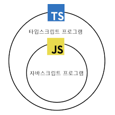

# 1장 타입스크립트 알아보기
TS의 큰 그림을 이해하는 데 도움이 될 내용을 다룬다.

---

## 아이템 1 TS와 JS의 관계 이해하기
- TS는 문법적으로 JS의 상위 집합이다.

### 근거
1. 모든 JS 코드는 TS 코드이다 (O)
2. 모든 TS 코드는 JS 코드이다 (X)

서로의 확장자 파일에서 코드를 실행시켜보면 된다.



---

## JS 코드르 실행시켜보자

```JavaScript
function greet(who) {
  console.log('Hello', who)
}
```
- TypeScript는 정상적으로 실행된다.
- JavaScript도 정상적으로 실행된다.

---

## TS 코드를 실행시켜보자

```TypeScript
function greet(who: string) {
  console.log('Hello', who)
}
```
- TypeScript는 정상적으로 실행된다.
- JavaScript는 `: who` 에서 SyntaxError가 발생한다.

---

## 무엇을 할수 있나?
- .js, .jsx 확장자를 .ts, .tsx로 바꿔도 문제가 없다.
- 이 특성이 JS를 TS로 마이그레이션 할때 아주 좋은 이점이 된다.

---

## TS의 다른 장점
타입 추론을 통해 에러를 더 자세하게 알려준다.
```JavaScript
let city = 'new york city'
console.log(city.toUppercase())

// TypeError: city.toUppercase is not a function
```
```TypeScript
let city = 'new york city'
console.log(city.toUppercase())

// 'toUppercase' 속성이 'string 형식에 없습니다.
// 'toUpperCase'을(를) 사용하시겠습니까?
```

---

## TS는 정적 타입 시스템이다
TS의 목표는 런타임에 오류를 발생시킬 코드를 '미리' 발견하는 것
= 다른 언어의 컴파일 에러를 생각하면 된다
= 인터프리터가 동작하기 전
= 정적 시스템

---

## 타입 체커가 모든 오류를 잡아내진 못한다
그래도 의도와 다르게 동작하는 코드 중 일부는 이를 잡아낸다.
```TypeScript
// state.capital을 capitol로 잘못 썼다
const states = [
  { name: 'Alabama', capitol: 'Montgomery' },
  { name: 'Alaska', capitol: 'Juneau' },
  { name: 'Arizona', capitol: 'Phoenix' },
]
for (const state of states) {
  console.loG(state.capital)
}
```

---

## TS의 오류 문구가 항상 맞지는 않다
우리는 capitol이 아니라 capital을 써야하는 것을 알고있다.
JS
```JavaScript
undefined
undefined
undefined
```
TS
```TypeScript
for (const state of states) {
  console.log(state.capital)
  // 'capital' 속성이 ... 형식에 없습니다.
  // 'capitol'을(를) 사용하시겠습니까?)
}
```

---

## 개선된 코드
```TypeScript
interface State {
  name: string;
  capital: string;
}
const states: State[] = {
  { name: 'Alabama', capitol: 'Montgomery' },
  // 'State' 형식에 'capitol'이(가) 없습니다.
  // 'capital'을(를) 쓰려고 했습니까?
}
```

---

## TS는 JS의 동작을 모델링한다.
### JS에서 동작하기에 오류가 발생하지 않는 경우
다른 언어에서는 에러가 발생해도 할말 없다
```TypeScript
const x = 2 + '3' // JS에선 '23'
const y = '2' + 3 // JS에선 '23'
```
### JS에서 오류가 아니지만 오류가 생기는 경우
그래도 JS의 모든 동작을 허용하진 않는다
```TypeScript
const a = null + 7 // JS에선 7
const b = [] + 12 // JS에선 12
alert('Hello', 'TypeScript') // JS에선 동작
```

---

## 아이템 2 TS 설정 이해하기
- TS의 설정은 100개가 넘어간다.
- CLI와 tsconfig.json 파일을 통해 적용할 수 있다.
- 동료들과의 설정을 공유하기 위해 가급적 파일을 사용하자.

---

## 고수준의 설정
- 대부분의 언어는 언저 자체의 핵심 요소들을 제어하는 설정이 없다.
- TS에는 이를 허용하는 고수준 설계의 설정이 가능하다.
- 어떻게 설정하냐에 따라 TS를 전혀 다른 언어처럼 느낄 수 있다.

---

## noInplicitAny
변수들이 미리 정의된 타입을 가져야 하는지 여부를 제어한다.

```TypeScript
// false: a, b가 암묵적 any 타입이 된다.
// true: a, b에 타입을 정의해줘야 한다.
function add(a, b) {
    return a + b
}
```
TS는 타입을 가질 떄 가장 효과적이기 때문에, noImplicitAny를 설정하자.
하지만 JS를 TS로 마이그레이션 하는 중일때는 해제해줘야 한다.

---

## strictNullChecks
null과 undefined가 모든 타입에서 혀용되는지 확인한다.
noImplicitAny를 먼저 설정해주어야 한다.
```TypeScript
// false: 가능
// true: 불가능, 'null' 형식은 'number' 형식에 할당할 수 없습니다
const x: number = null
```
만약 null을 허용하려면 타입에 추가해줘야 한다.
```TypeScript
const x: number | null = null
```

---

## strictNullChecks
만약 허용하지 않으려면, 값을 가져온 부분에서, null을 체크하거나 단언문을 추가해야 한다.
```TypeScript
const el = document.getElementById('status')

if (el) {
  el.textContent = 'Ready'
}
// 또는
el!.textCOntent = 'Ready'
```
만약 이 설정을 적용하지 않는다면, 절대 'undefined'는 객체가 아닙니다.' 오류를 조심해...

---

## 아이템3 코드 생성과 타입이 관계없음을 이해하기
### TS 컴파일러의 역할은 크게 두가지다
1. 최신 TS/JS를 브라우저에서 동작할 수 있도록 구버전의 JS로 트랜스파일
2. 코드의 타입 오류를 체크

이 두 가지 역할은 서로 독립적이다.
간단하게 실행과 타입체크가 독립적이라고 이해하자.

---

## 타입 오류가 있는 코드도 컴파일이 가능하다.
```TypeScript
// 타입 체커에 걸리지만, 컴파일은 된다.
let x = 'hello'
x = 1234
```
### 장점
- 문제를 수정하지 않아도 어플리케이션의 오류가 없는 부분은 계속 테스트 가능하다.
### 컴파일 안하고 싶으면
- tsconfig.json에서 `noEmitOnError` 옵션을 사용하자.

---

## 런타임에는 타입 체크가 불가능하다
instance 체크는 런타임에 일어나지만 Rectangle은 타입이기 때문에 런타임에 사용할수 없다.
```TypeScript
interface Square {
  width: number;
}
interface Rectangle extends Square {
  height: number;
}
type Shape = Square | Rectangle

function calculateArea(shape: Shape) {
  if (shape instanceof Rectangle) {
    // 'Rectangle'은 형식이지만, 여기선 값으로 사용되고 있습니다.
    return shape.width * shape.height;
    // 'Shape' 형식에 'height' 속성이 없습니다.
  } else {
    shape.width * shape.width
  }
}
```

---

## 런타임에는 타입 체크가 불가능하다
### 해결법 1. 타입에 존재하는 속성으로 구분한다
타입 체커도 shape를 보정해준다
```TypeScript
function calculateArea(shape: Shape) {
  if ('height' in shape) {
    shape // 타입이 Rectangle
    return shape.width * shape.height
  } else {
    shape // 타입이 Square
    return shpae.width ** 2
  }
}
```

---

## 런타임에는 타입 체크가 불가능하다
### 해결법 2. 타입에 태그를 저장한다
일반적으로 TS에서 많이 볼수 있는 형식이다.
```TypeScript
interface Square {
  kind: 'square';
  width: number;
}
interface Rectangle {
  kind: 'rectangle';
  width: number;
  height: number;
}
```

---

## 런타임에는 타입 체크가 불가능하다
### 해결법 3. 타입과 값으로 모두 사용될 수 있는 형식을 쓴다
클래스는 타입과 값으로 모두 사용될 수 있다.
```TypeScript
class Square {
  constructor(public width: number) {}
}
class Rectangle extends Square {
  constructor(public width: number, public height: number) {
    super(width)
  }
}
type Shape = Square | Rectangle
```

---

## 타입 연산은 런타임에 영향을 주지 않는다
아래 TS 코드가 변환되는 것을 보자
```TypeScript
// 변환전 TS
function asNumber(val: number | string): number {
  return val as Number
}
// 타입 연산이 사라져 의미가 없어졌다
function asNumber(val) {
  return val
}
```
따라서 값을 정제하려면 런타임의 타입을 체크해 JS 연산을 해야한다.
```TypeScript
function asNumber(val: number | string): number {
  return typeof(val) === 'string' ? Number(val) : val
}
```

---

## 런타임 타입은 선언된 타입과 다를 수 있다
`: boolean`이 런타임에는 없어져 다른 타입이 들어오면 default가 실행될 수 있다
```TypeScript
function setLightSwitch(value: boolean) {
  switch (value) {
    case true:
      turnLightOn();
      break;
    case false:
      turnLightOff();
      break;
    default:
      console.log('실행되나?')
  }
}
```

---

### 순수 TS도 가능하다
API의 반환값은 런타임에서만 확인할 수 있다.
그렇기 떄문에 반환값이 boolean값이 아니라면 제대로 동작하지 않을 수 있다.
```TypeScript
interface LightApiResponse {
  lightSwitchValue: boolean;
}
async function setLight() {
  const response = await fetch('/light')
  const result: LightApiResponse = await response.json()
  setLightSwitch(result.lightSwitchValue)
}
```

---

## 타입으로는 함수를 오버로드 할 수 없다
C++ 같은 객체지향 언어에서는 함수 오버로드를 허용하고 있다.
하지만 TS는 타입과 런타임의 동작이 무관하기 때문에, 함수 오버로딩은 불가능하다.
```TypeScript
function add(a: number, b: number) { return a + b }
// 중복된 함수 구현입니다
function add(b: string, b: string) { return a + b }
// 중복된 함수 구현입니다
```
TS에서 지원하는 함수 오버로딩은 온전히 타입 수준에서만 동작한다.

---

